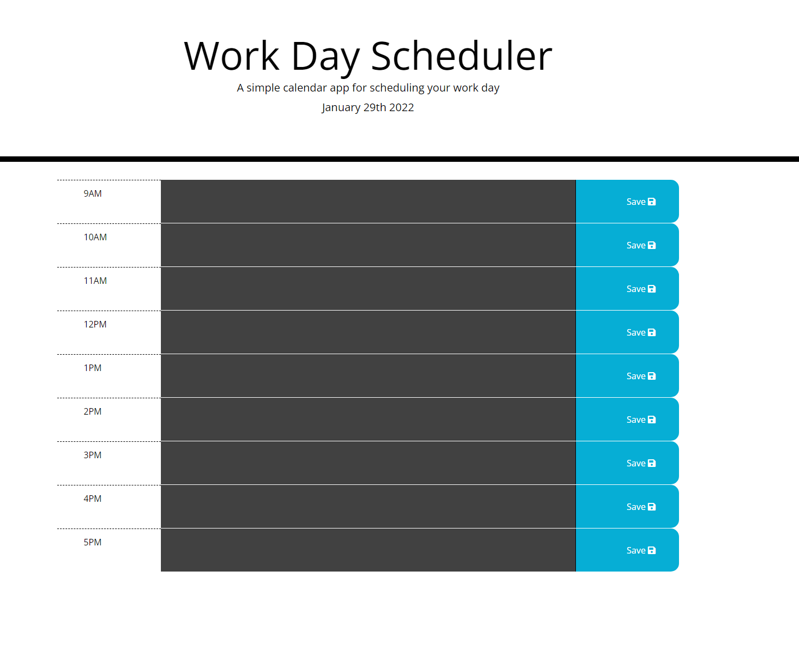
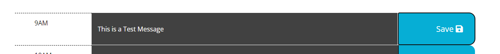

# Work Day Scheduler
## Table Of Contents
- [Description](#Description)
- [Technology](#Technology)
- [Usage](#usage)
- [Installation](#installation)
- [Credits](#Credits)
- [License](#license)

## Description

This page was designed to help plan a Person's day. My goal was to utilize local storage JQuery and  Moment.js to build something dynamic. 

## Technology

JQuery, Font Awesome, Moment.js, and bootstrap

## Usage

After landing on the page you will be presented with the workday split into 1-hour Timeslots. The current hour will be shown in red, future hours will be shown in green, and past hours will be shown in grey.

Write a message in the middle column and save it to the local storage with the save button on the right. 

## Installation

No steps are required for installation, Everything works on the front end and there is no real back-end to talk about. You can clone this repo to your own github and deploy to pages immediately.

## Credits
I would like to thank [klangs34](https://github.com/klangs34) for a good starting point from which I was able to create the rest of the code. 
I would also like to thank W3Schools for their various tutorials about bootstrap classes.

## License

MIT License

Copyright (c) [2022] [Chris Koilparampil]

Permission is hereby granted, free of charge, to any person obtaining a copy
of this software and associated documentation files (the "Software"), to deal
in the Software without restriction, including without limitation the rights
to use, copy, modify, merge, publish, distribute, sublicense, and/or sell
copies of the Software, and to permit persons to whom the Software is
furnished to do so, subject to the following conditions:

The above copyright notice and this permission notice shall be included in all
copies or substantial portions of the Software.

THE SOFTWARE IS PROVIDED "AS IS", WITHOUT WARRANTY OF ANY KIND, EXPRESS OR
IMPLIED, INCLUDING BUT NOT LIMITED TO THE WARRANTIES OF MERCHANTABILITY,
FITNESS FOR A PARTICULAR PURPOSE AND NONINFRINGEMENT. IN NO EVENT SHALL THE
AUTHORS OR COPYRIGHT HOLDERS BE LIABLE FOR ANY CLAIM, DAMAGES OR OTHER
LIABILITY, WHETHER IN AN ACTION OF CONTRACT, TORT OR OTHERWISE, ARISING FROM,
OUT OF OR IN CONNECTION WITH THE SOFTWARE OR THE USE OR OTHER DEALINGS IN THE
SOFTWARE.
